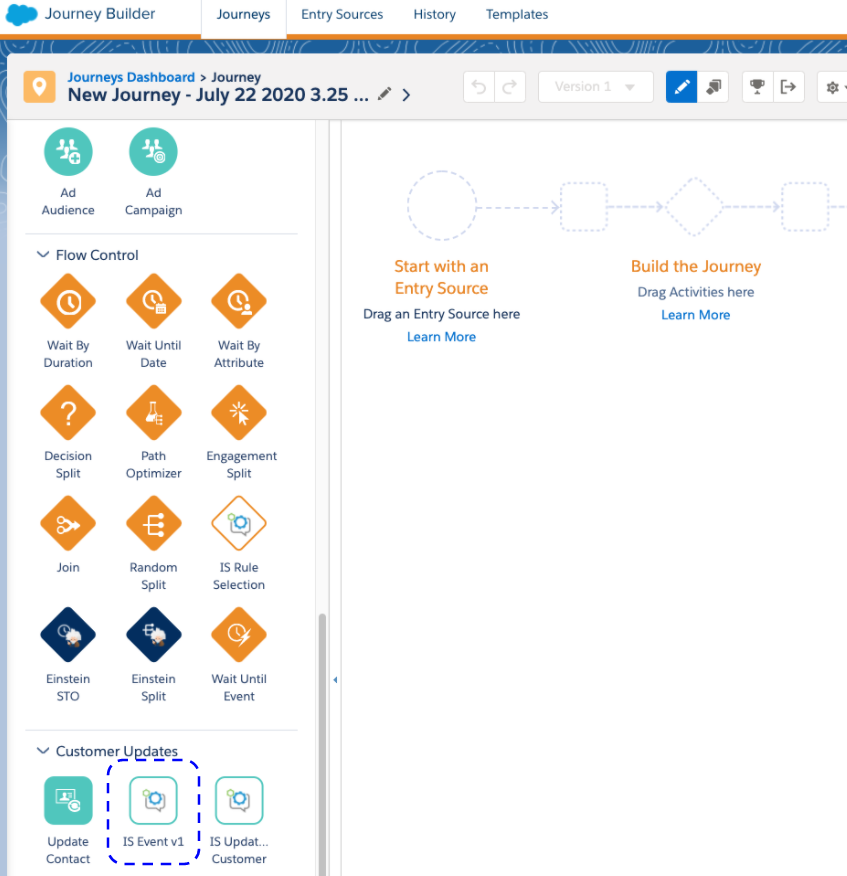

<!-- Headings -->
# Interaction Studio Event Custom Activity

<p>Please follow the below steps for configuring this custom activity in Journey Builder.</p>

## Step 0 - Get Heroku

[Verify you have a Heroku account.](https://www.heroku.com)

## Step 1 - Initial Setup

### Create a package inside of Marketing Cloud, with a Jourey Builder component.

1. Go to Setup<br><br>

2. Go to Platform Tools > Apps > Installed Packages<br><br>

3. Click on the 'New' button<br><br>

4. Enter something descriptive as your Package name<br><br>

5. Click 'Save'<br><br> 

**IMPORTANT: Copy and paste the JWT SIGNING SECRET into a separate notepad document. We will need it bit later** 

6. Click the ‘Add Component’ button<br><br>

7. Select ‘Journey Builder Activity’ and click Next<br><br>

8. Enter the following for your Package Component:

 Field | Value  |
| ------ | --------- |
| Name | *Something intuitive*|
| Description | *Leave blank* |
| Category | Customer Updates |
| Endpoint URL | *Nothing has been deployed to Heroku up to this point, however, we need to create this Activity in order to get the application key. For the time being (since this is a required field), enter in: https://herokuapp.com/ixn/activities/generic-activity and click Save.*|


## Step 2 - Deploy the Heroku Application

1. Click the button below to deploy this application to Heroku (**You must be logged into your Heroku Account beforehand**).

[](https://heroku.com/deploy)

2. When you click on the ‘Deploy to Heroku’ button to begin the deployment process, you will presented with the following variables. Because most of them are required, **you must configure** them before you deploy the app within Heroku (ensure you are authenticated to your Heroku account for this to work).<br><br>

<br><br>

3. Fill out the form variables:

 Variable Name | Description | Required |
| ------ | --------- | --------- |
| App Name | The name of the App on Heroku. Give it a descriptive name | Yes |
| APPLICATION_DOMAIN | Using the aforementioned App Name, provide the fully qualified Heroku App URL | Yes |
| IS_ENDPOINT | API URL for Interaction Studio Events. In the format https://[ACCOUNT].evergage.com/api2/event/[DATASET] | Yes |
| IS_PRODUCTION | Used for debugging purposes. By default its set to True. Keep the default.| Yes |
| JWT_SIGNING_SECRET | Paste the JWT Signing Secret from Step 1| Yes |
| LOG_NOTIFICATION_URL | Used for debugging purposes. Sends app log details to an external system such as Request.Bin. Leave it Empty| No |

<br><br>4. After you have completed all of the required form fields - click on the *Deploy app* button at the bottom of the page.<br><br>
5. Once the app is deployed successfully (validate that it is actually deployed, you will see a success message).

## Step 3 - Validate your Heroku Deploy

1. Test this URL after deployment:<br>

http://[YOUR_APP_NAME_HERE].herokuapp.com/config.json


<br><br><br>

2. You can paste the contents of that file into an online JSON formatting tool to check that it looks like this:

```javascript
{
   "workflowApiVersion":"1.1",
   "metaData":{
      "icon":"static/icon1.png",
      "iconSmall":"static/iconSmall1.png",
      "category":"customer"
   },
   "key":"REST1",
   "type":"REST",
   "lang":{
      "en-US":{
         "name":"IS Event v1",
         "description":"An example REST activity using workflow API v1.1 format."
      }
   },
   "arguments":{
      "execute":{
         "outArguments":[
            {
               "SegmentMembership":""
            }
         ],
         "url":"https://[YOUR_APP_NAME].herokuapp.com/journeybuilder/execute/",
         "verb":"POST",
         "body":"",
         "header":"",
         "format":"json",
         "useJwt":true,
         "timeout":10000
      }
   },
   "configurationArguments":{
      "save":{
         "url":"https://[YOUR_APP_NAME].herokuapp.com/journeybuilder/save/",
         "verb":"POST",
         "useJwt":true
      },
      "publish":{
         "url":"https://[YOUR_APP_NAME].herokuapp.com/journeybuilder/publish/",
         "verb":"POST",
         "useJwt":true
      },
      "stop":{
         "url":"https://[YOUR_APP_NAME].herokuapp.com/journeybuilder/stop/",
         "verb":"POST",
         "useJwt":true
      },
      "validate":{
         "url":"https://[YOUR_APP_NAME].herokuapp.com/journeybuilder/validate/",
         "verb":"POST",
         "useJwt":true
      }
   },
   "wizardSteps":[
      {
         "label":"Step 1",
         "key":"step1"
      },
      {
         "label":"Step 2",
         "key":"step2"
      }
   ],
   "userInterfaces":{
      "configModal":{
         "height":300,
         "width":800,
         "fullscreen":true
      }
   },
   "schema":{
      "arguments":{
         "execute":{
            "outArguments":[
               {
                  "SegmentMembership":{
                     "dataType":"Text",
                     "direction":"out",
                     "access":"visible"
                  }
               }
            ]
         }
      }
   }
}
```

3. Locate the activity in Journey Builder

<br><br><br>
